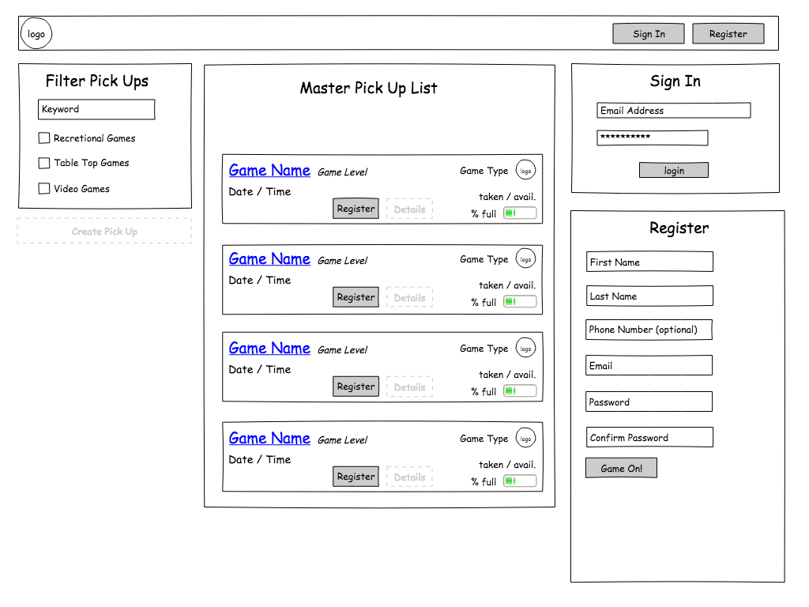

# Pick Ups

## Purpose
This application serves to provide users with a way to:
* Find, join, and participate in local recreational, table top, and video game meetups
* Meet new people
* Subscribe to recurring pick up games

## MVP Features and Resources
### **Features**
* #### Users Can...
  * log in and log out
  * create a pick up game
  * view a list of all pick up games
  * register for a pick up game
  * view a list of registered games
  * cancel a registered game

### **Resources**
* React
* Webpack
* Redux
* Jest
* Moment
* A database → firebase?

## Stretch Features and Resources
### **Features**
* #### Users can …
  * update/delete user created events
  * add friends
  * invite friends to the site
  * invite friends to a game
  * communicate via pickup game message board
  * search for games by keyword, category, date, time, location
  * view google map of where location is

* #### Gamify by adding points/perks for hosting and verifying pick up game or participating in pick up game

* #### Email/Text Reminders for users close to game time

### Resources
* Google Maps API
* Twilio? (some client to send emails/text close to game time)
* GraphQL?
* Apollo?

# Site MockUps
### Splash Page

### Splash Page Opt. 2

### Home Page Signed In

### Home Page Signed Out

